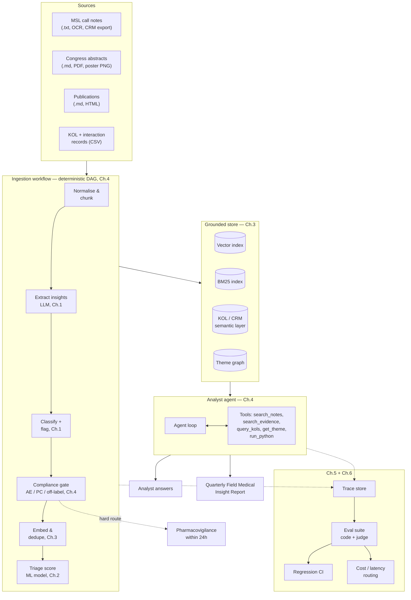
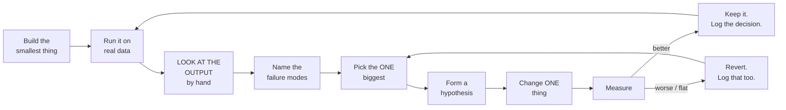

# Chapter 0 — Orientation

*Prerequisites: comfortable Python. No LLM experience assumed.*
*Time: ~45 minutes, most of it reading call notes rather than writing code.*

---

## 0.1 What you are building

**InsightHub** — a field medical insight engine for Kestrel Bio's (fictional) product
VELTRAXA® (zoltarimab) in ulcerative colitis.

By the end of Chapter 7 it will do this:



Do not be intimidated by the diagram. You build it one box at a time, and after each box
you *look at what it produced* and decide what to do next. That loop is the actual
subject of this tutorial.

---

## 0.2 What a Medical Affairs person actually means by "insight"

You need this vocabulary or Chapter 5 will make no sense. Five minutes.

**MSL (Medical Science Liaison).** A field-based scientist employed by a pharma company.
They meet clinicians — usually specialists, often researchers — for *scientific exchange*:
discussing data, answering clinical questions, understanding how the therapy area is
evolving. They are not sales. In most companies there is a hard firewall between Medical
and Commercial, and what an MSL hears must not be used to target prescribing.

**Insight.** Not a summary of the meeting. An insight is *something the clinician
contributed that the company did not already know and could act on*. The classic internal
definition:

> An insight is an observation, question or behaviour from an external expert that, if
> true and repeated, would change what we do.

Three things are therefore **not** insights, and your system will produce all three
constantly:

| Not an insight | Example from our data | Why not |
|---|---|---|
| A record of what the MSL did | "Walked through the mechanism of action deck." | That's an activity log entry. |
| A restatement of published data | "Reviewed the AURORA-1 primary endpoint." | The company already knows this. |
| Logistics | "Rescheduled from last Tuesday." | No medical content. |

**Theme.** Many insights, from different clinicians in different words, pointing at the
same underlying thing. "He said it takes 8 weeks", "response is slower than the label
suggests", "patients get anxious at week 5" are three insights and one theme. Themes, not
individual insights, are what the medical strategy team acts on — which is why Chapter 3
spends real effort on clustering and deduplication.

**Strategic priority.** The company's medical objectives for the year (ours are SP1–SP5
in `data/product/veltraxa_fact_base.md`). Insights that map to a priority get attention;
insights that don't may still matter, but they compete for a limited review queue. That
scarcity is what makes Chapter 2's triage model a real ranking problem rather than a toy.

### The three compliance rules that shape the architecture

These are simplified but directionally real, and they drive design decisions in Chapters
4, 5 and 6:

1. **Adverse events.** If a note mentions *any* adverse experience in a patient taking the
   product — however vague, however clearly unrelated — it must reach Pharmacovigilance
   within 24 hours. There is no "probably not important" tier. This is a legal obligation
   with regulatory consequences for the company.
   *Engineering consequence:* AE detection is a **high-recall, non-negotiable gate**, and
   it must not be something an LLM can talk itself out of.
2. **Off-label.** Information outside the approved indication can only be provided
   reactively, through Medical Information, in response to an unsolicited request. Our
   product is approved in UC; HORIZON-CD is in Crohn's. Any Crohn's question is off-label
   territory.
   *Engineering consequence:* the agent must be able to *refuse and route* rather than
   answer, and your evals must test that it does.
3. **Medical/Commercial firewall.** Aggregated themes may be shared with strategy;
   individual attributed opinions may not leak to Commercial.
   *Engineering consequence:* attribution has to be structurally separable from content,
   and any outbound tool is an exfiltration risk (Chapter 4 §4.9).

---

## 0.3 Set up

```bash
cd insighthub
python -m venv .venv && source .venv/bin/activate     # Windows: .venv\Scripts\activate
pip install -r requirements.txt
cp .env.example .env          # paste your key from console.anthropic.com
export PYTHONPATH=$PWD/src    # or add src/ to your IDE's path
python -c "from insighthub.config import check; check()"
```

Expected output:

```
OK. 140 call notes, models: claude-haiku-4-5-20251001 / claude-sonnet-5 / claude-opus-5
```

The `sentence-transformers` install is the slow one (~2 GB with torch). It downloads a
small embedding model the first time you use it in Chapter 3. If you'd rather not, that
chapter explains the hosted alternative — but the local model is free and the whole point
of Chapter 3 §3.4 is to watch embeddings work without a black box in the way.

---

## 0.4 Tour the data

Spend ten minutes here. Everything downstream depends on your having an honest feel for
how messy the input is.

```bash
ls data/call_notes | head
wc -l data/call_notes/manifest.csv
cat data/call_notes/NOTE-0001.txt
cat data/call_notes/NOTE-0003.txt      # telegraphic MSL, abbreviations
cat data/call_notes/NOTE-0009.txt      # long advisory-board debrief
cat data/call_notes/NOTE-0017.txt      # pure logistics, zero insights
cat data/raw/ocr_call_note.txt         # OCR damage: 'l' for 'I', 'O' for '0'
```

Eight MSLs write in four different styles — bullets, narrative, telegraphic
abbreviations, and a rigid template. Two of the 140 notes contain a **prompt injection**
planted by a hypothetical adversary; you will not be told which until Chapter 4, and if
your Chapter 1 extractor happens to run over one, you may see something strange. That is
deliberate.

A quick census:

```bash
python - <<'PY'
import csv, collections, statistics
rows = list(csv.DictReader(open("data/call_notes/manifest.csv")))
print("notes:", len(rows))
print("by MSL:", collections.Counter(r["msl_name"] for r in rows).most_common())
print("by region:", collections.Counter(r["region"] for r in rows).most_common())
lens = [int(r["n_chars"]) for r in rows]
print("chars: min %d  median %d  max %d" % (min(lens), statistics.median(lens), max(lens)))
print("splits:", collections.Counter(r["split"] for r in rows))
PY
```

The splits matter:

| Split | Notes | Use |
|---|---|---|
| `dev` | 1–60 | Look at these. Iterate on these. Break these. |
| `test` | 61–100 | Touch only when you're ready to report a number. |
| `holdout` | 101–140 | Chapter 6 only. Simulates "new data arriving in production". |

The single fastest way to fool yourself in this field is to iterate on the same examples
you report results on. The split exists to stop you.

> ### ⚠️ Do not open `data/eval/gold_insights.jsonl` yet
> It contains ground-truth labels for every note. In real life nobody hands you those —
> you *create* them by reading outputs, which is exactly the skill Chapter 5 teaches. If
> you peek now, Chapter 5 becomes a much worse lesson. It'll still be there.

---

## 0.5 The most important exercise in this tutorial

Do this before you write a line of code.

1. Open ten dev call notes at random: `NOTE-0004`, `0011`, `0019`, `0023`, `0031`,
   `0038`, `0042`, `0047`, `0053`, `0058`.
2. For each one, write down by hand, in your own words, every insight you think it
   contains. Number them.
3. Now write, in **at most 60 words**, your definition of what counts as an insight —
   specific enough that another person applying it to the same ten notes would produce
   the same list you did.
4. Save it as `DECISIONS.md` in the repo root under the heading `## My insight definition (v0)`.

You will find this harder than expected. Some notes are obvious. Some contain a sentence
that is either an insight or a paraphrase of the label, depending on how you squint. You
will change your mind partway through and want to go back and relabel the first three.

**That difficulty is the whole subject of Chapter 5.** If you cannot state the criterion
crisply, no prompt you write can, and no eval you build will be stable. Nearly every
failed LLM project I have seen failed here — at the definition — and then spent six
months blaming the model.

Keep your v0 definition. In Chapter 5 you will compare it to the one you arrive at after
looking at 100 model outputs, and the gap between them is the lesson.

---

## 0.6 The loop

Every chapter from here runs the same cycle. Print it and stick it somewhere.



Two rules that people break constantly:

- **Change one thing.** If you change the prompt and the model and the chunking, and the
  number moves, you have learned nothing about which of the three did it.
- **Look at the output.** Not the aggregate score — the actual text, at least 20 examples,
  with your own eyes. Every chapter has a "Stop and look" box that forces this. Do them.
  Skipping them is the difference between finishing this tutorial having learned the
  material and finishing it having typed it.

---

## 0.7 Decision log

Create `DECISIONS.md` now. Each entry:

```markdown
### D-001 — <short title>
**Date:** 2026-08-21 | **Chapter:** 1

**Observed.** Extraction returned 3.4 insights per note; ~40% were restatements of
what the MSL presented rather than HCP contributions.

**Hypothesised.** The prompt says "extract insights" without defining what one is, so
the model defaults to summarisation.

**Changed.** Added a 4-line definition + 3 negative examples to the system prompt.
Nothing else.

**Result.** Insights/note fell to 2.1. Spot-checking 20 notes, restatements fell from
8/20 to 2/20. Two real insights were now missed.

**Decided.** Keep. The precision gain is worth the two misses at this stage; revisit
recall once evals exist. **Not** doing: adding more examples yet — I want to see whether
Chapter 3's retrieval changes the picture first.
```

That format — *observed, hypothesised, changed, result, decided, and explicitly what you
chose not to do* — is what separates systematic iteration from vibes.

---

**Next:** [Chapter 1 — LLM foundations](01-llm-foundations.md)
