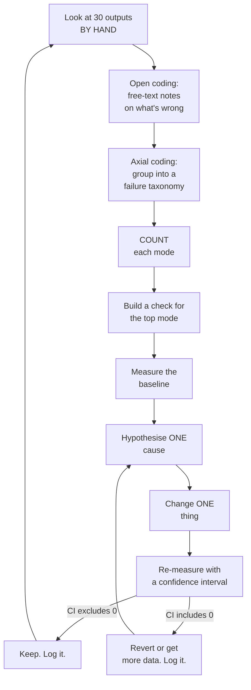

# Chapter 5 — Evaluation-driven development

*You will build: `evals/code_evals.py`, `evals/matching.py`, `evals/judge.py`,
`evals/run.py` — and then run three measured iterations on the extractor.*
*Time: ~8 hours, and worth every one. API spend: ~$5.*

**The skill:** Andrew Ng singles this out as *the* trait that distinguishes people who are good at
AI Engineering. Not prompt craft. Not architecture. The ability to run a disciplined error-analysis
loop, so that progress is systematic rather than random.

This chapter is long because the skill is hard, and because the part everyone skips —
looking at outputs by hand, and validating the judge — is the part that does the work.

> **A note on the numbers below.** Blocks marked **Measured** were produced by running the
> code in this repo and you should reproduce them closely. Blocks marked *Illustrative*
> show the **shape** of a result — the relationship between the numbers and what it means
> — using plausible values. Your run will differ. The reasoning is the transferable part;
> never copy a number you did not produce into a decision log.

---

## 5.0 The trap this chapter exists to prevent

Here is what almost everyone does. You have a system. It seems okay. You think of an
improvement, you make it, you try three examples, they look better, you ship it. Two weeks
later quality is worse than when you started and you have no idea which of your nine
changes did it.

You cannot fix that with better prompts. You fix it with a loop:



Every arrow matters. The one people skip is the first.

---

## 5.1 Now you may open the labels

Chapter 0 asked you not to look at `data/eval/gold_insights.jsonl`. You can now — but read
this first, because the order matters.

**In real life nobody hands you labels.** You create them, by looking at outputs, arguing
about edge cases, and writing down a definition precise enough that two people apply it
the same way. That is a real, expensive, unavoidable project, and it is the highest-value
work in an AI system.

So do §5.2 first, *then* open the file. The gold labels here exist because the data is
synthetic, and they let you check your own labelling against a fixed answer — a luxury you
will never have again.

Fetch your `## My insight definition (v0)` from Chapter 0 §0.5. You'll need it in §5.3.

---

## 5.2 Error analysis: open coding

Take the run from Chapter 1 and look at thirty outputs. Not the score — the text.

```bash
PYTHONPATH=src python scripts/ch5_error_analysis.py runs/ch1_dev_v1.jsonl --n 30
```

For each note: the note, the extracted insights, and a prompt asking what's wrong. Type it
in **your own words**. Do not use a fixed vocabulary yet.

This is **open coding**, borrowed from qualitative research, and the discipline is that
you describe before you categorise. Invent categories first and you will spend the next
month measuring the failures you imagined rather than the ones you have.

*Illustrative* — expect notes like:

```
"insight 2 is just what the MSL presented"
"split one idea about infusion capacity into two"
"says 'clinicians' but only one person said it"
"verbatim has been cleaned up - the note has a typo, the verbatim doesn't"
"missed the pouchitis question entirely"
"category is DIAGNOSTIC_MONITORING, I'd have said DATA_GAP"
"flagged an AE for 'patients are anxious' - that's not an AE"
```

Thirty notes takes about 45 minutes. **Do not shortcut this.** Every subsequent decision
in this chapter depends on knowing what is actually wrong, and there is no way to find out
except by looking.

### Axial coding: group and count

Open `runs/error_analysis.csv` and fill in the `code` column, grouping your free-text
notes into a small taxonomy — aim for 6–10 codes. Then:

```bash
PYTHONPATH=src python scripts/ch5_error_analysis.py --report
```

*Illustrative* — a taxonomy of this shape, with counts:

```
  11  27.5%  MSL_ACTIVITY_AS_INSIGHT
   8  20.0%  MISSED_INSIGHT
   6  15.0%  OVERGENERALISED
   5  12.5%  CATEGORY_DISPUTABLE
   4  10.0%  VERBATIM_PARAPHRASED
   3   7.5%  SPLIT_ONE_IDEA
   2   5.0%  SPURIOUS_AE_FLAG
   1   2.5%  MERGED_TWO_IDEAS
```

**The counts are the point.** Not the list — the counts. Without them you will work on
`SPURIOUS_AE_FLAG` because it was the most annoying one you saw, and leave 27.5% of your
failures untouched.

Two other things this table tells you:

- **`CATEGORY_DISPUTABLE` at 12.5% is a signal about your taxonomy, not your model.** When
  you cannot decide the category yourself, neither can the model, and no prompt fixes it.
  Either the categories overlap and should be merged, or you need a tie-break rule written
  into the taxonomy.
- **`MISSED_INSIGHT` at 20% is invisible in most people's evals**, because it is much
  harder to notice absence than presence. It only showed up because you read the *note*,
  not just the output. Evals that only score what was produced systematically ignore
  recall.

---

## 5.3 Rewrite the definition

You have now read ~100 model outputs against ~30 notes. Rewrite your insight definition.

Compare v1 to your Chapter 0 v0. In our experience the changes cluster in three places:

1. **The MSL/HCP boundary** needs to be explicit and up front. "What the HCP contributed"
   isn't enough — you need "not what the MSL presented, even if the HCP nodded".
2. **Granularity needs a rule.** "One insight per distinct idea" is ambiguous when a
   clinician makes one point with two consequences. Pick a rule (we use: *one insight per
   distinct thing the company could act on differently*) and write it down. Any consistent
   rule beats no rule.
3. **Scope of claim needs a rule.** "Report what this note supports, never generalise to a
   population" — because you saw six overgeneralisations and none of them were reasonable.

**This is the actual deliverable of error analysis.** Not the prompt fix — the sharper
definition. The prompt is downstream of it, the eval is downstream of it, and the human
reviewers need it too.

Now open `gold_insights.jsonl` and compare your labels for five notes against it. Where
you disagree, ask whether *your* rule or *theirs* is more defensible. Sometimes yours is.
That disagreement is exactly what happens with human annotators, and it is why inter-rater
agreement (§5.7) is a number you have to measure rather than assume.

---

## 5.4 Layer 1: code evals

**If a check can be code, it must be code.** Free, instant, perfectly reliable, and it
runs in production as well as in the eval suite.

`evals/code_evals.py` has eleven. The highest-value one is three lines:

```python
def check_verbatim_is_substring(row, body):
    bad = [i["verbatim"] for i in row["insights"] if i["verbatim"] not in body]
    return CheckResult("verbatim_is_substring", not bad, ..., severity="blocking")
```

Recall from Chapter 1 §1.5 that we designed the schema to make this possible. **That is
the transferable move: design your output format so the thing you most need to verify is
mechanically verifiable.** A `verbatim` field costs nothing and converts "is this
faithful?" from a judgement call into a substring test.

Run them:

```bash
PYTHONPATH=src python -m insighthub.evals.run --run runs/ch1_dev_v1.jsonl --split dev
```

**Measured** (against the offline fixture from `scripts/make_mock_run.py`; a real run
will differ, but the report shape is identical):

```
code evals (pass rate over notes):
  FAIL no_overgeneralisation             73.3%
  FAIL ae_flag_recall                    75.0%
  FAIL verbatim_is_substring             85.0%
  FAIL not_msl_activity                  85.0%
  FAIL no_duplicate_verbatim             91.7%
  FAIL no_promotional_language           96.7%
  ok   categories_valid                 100.0%
  ...
  !! 11 BLOCKING failures
```

> **Our run diverged here.** Against the real `ch1_dev_v1.jsonl` (not the mock fixture),
> `verbatim_is_substring`, `no_duplicate_verbatim` and `no_promotional_language` all came
> back 100% pass — noticeably cleaner than this fixture's numbers. See D-025/D-032 in
> `DECISIONS.md` for the full real report. Don't be surprised if your own run doesn't match
> this block closely; it's the fixture's shape, not a target to hit.

### Exact checks vs heuristic checks

This distinction is worth more than the checks themselves.

**Exact checks** are decidable: `verbatim in body`, `category in taxonomy`,
`0 <= confidence <= 1`. A failure is definitely a failure. These can be `blocking`.

**Heuristic checks** are proxies: `not_msl_activity` is a regex for phrases like "walked
through"; `ae_flag_recall` compares the model's flag against a lexical gate with ~37%
precision (Chapter 4 §4.8). They fire on things that are fine.

So **severity must track how trustworthy the check is, not how scary the thing it looks
for sounds.** `ae_flag_recall` is about adverse events — the most consequential topic in
the system — and it is `medium`, because the check itself is noisy and because routing
does not depend on it (the union gate handles that). Getting this wrong in the other
direction is how teams end up with a CI pipeline that blocks every deploy and gets
disabled within a month.

**Measure your heuristic checks too.** Hand-label 20 `not_msl_activity` failures. If more
than a quarter are false alarms, the check is costing you more attention than it saves.

---

## 5.5 Layer 2: matching, so recall exists

Code evals score what was produced. They cannot tell you what was missed — and
`MISSED_INSIGHT` was 20% of your failures.

To compute recall you must decide when a predicted insight *is* a labelled one. That is an
arbitrary decision inside your evaluation, it moves your numbers, and it must be explicit.
`evals/matching.py` uses embedding similarity plus greedy one-to-one matching at
`threshold=0.55`.

**Measured** (same fixture):

```
extraction vs labels (match threshold 0.55):
  tp=72 fp=11 fn=41
  precision 0.867  95% CI (0.798, 0.931)
  recall    0.637  95% CI (0.545, 0.718)
  f1        0.735  95% CI (0.662, 0.796)
  category accuracy (matched pairs only) 0.847
```

> **Our real run diverged sharply — worth reading before you form expectations.** Against
> `ch1_dev_v1.jsonl` at threshold 0.55: `precision 0.345, recall 0.442, f1 0.388` — nowhere
> near this fixture's 0.867/0.637/0.735. We traced it directly: many predicted insights that
> are obviously thematically correct (verified by hand) score 0.45-0.55 cosine similarity
> against their gold match, just under the cutoff — e.g. a prediction about oral-agent
> preference in newly diagnosed patients scored 0.498 against gold's near-identical
> statement. Two compounding causes, both real: `all-MiniLM-L6-v2` isn't paraphrase-tuned,
> and gold's `canonical` text is a seed-level population statement (see `scripts/gen/world.py`)
> rather than a note-scoped one — so a correctly-scoped, note-level prediction is
> structurally penalised for following §5.3's own scope-of-claim rule. Full trace in
> D-030 (`DECISIONS.md`). **Do not assume your numbers should look like this block's — check
> your own threshold-sensitivity curve (below) before trusting any absolute number here.**

Four things about this block:

**Precision 0.87, recall 0.64.** The extractor is careful and misses a lot. Whether that's
the right trade depends on the product: for a system feeding a human review queue, recall
matters more, because a human can dismiss a bad insight in five seconds but cannot recover
one that was never surfaced. Write that down as a decision — it determines which direction
you push in §5.8.

**Category accuracy is computed only on matched pairs.** Scoring the category of a
hallucinated insight is meaningless. Metrics that mix "did it find the right thing" with
"did it label the thing right" hide which one is broken.

**Always run threshold sensitivity:**

```
  t=0.40  P=0.867 R=0.637 F1=0.735
  t=0.50  P=0.867 R=0.637 F1=0.735
  t=0.55  P=0.867 R=0.637 F1=0.735
  t=0.70  P=0.851 R=0.611 F1=0.711
```

If F1 swings 15 points across plausible thresholds, **your metric is measuring your
matcher, not your extractor**, and any A/B comparison you run is noise. (With the offline
fixture from `make_mock_run.py` the curve is perfectly flat, because the mock emits the
gold text verbatim. Real runs vary. If yours is flat, check you're not evaluating a
fixture.)

> **Our real curve is the non-flat kind, and dramatically so:** `t=0.40 F1=0.674, t=0.55
> F1=0.388, t=0.60 F1=0.310, t=0.70 F1=0.116` — a 56-point swing, nearly 4x this section's
> own 15-point red flag. That's proof we're scoring real output (per the paragraph above),
> and by this section's own stated rule, proof the 0.55 threshold's absolute numbers aren't
> trustworthy for this corpus yet. See D-030.

**The confidence intervals are the headline.** Recall is 0.637, and it is somewhere
between 0.545 and 0.718. On 60 notes, that ±9-point band is what you have. **A prompt
change that moves recall by 4 points has not been measured.** Note that `bootstrap_metric`
resamples *notes*, not insights — insights within a note are correlated, and resampling
them independently gives you an interval that is too narrow and a confidence you have not
earned.

### How much data do you need?

Rule of thumb for a proportion around 0.5: the 95% interval half-width is about
`1/sqrt(n)`.

| Eval examples | ± on a rate | Smallest change you can detect |
|---|---|---|
| 30 | ±18 pts | enormous |
| 60 | ±13 pts | very large |
| 200 | ±7 pts | large |
| 1,000 | ±3 pts | moderate |

Our 60 dev notes can detect "this made things much better" and nothing finer. Two
consequences: **make big changes early**, and **paired comparisons beat independent ones**
— comparing two systems on the *same* examples cancels example difficulty and gives you a
much tighter interval on the difference than on either absolute number.

---

## 5.6 Layer 3: an LLM judge

Some criteria resist code. "Is this an insight or a restatement?" "Is the category the
best fit?" "Is this an overgeneralisation?" — the regex catches `all`/`most` but misses
"the field feels".

So: a judge. And then, immediately, the part everyone skips.

Here is the prompt everyone writes first (`JUDGE_V1`):

```python
JUDGE_V1 = """You evaluate insights extracted from pharmaceutical field medical call
notes. Decide whether each extracted insight is a good insight. Answer PASS or FAIL."""
```

Before believing anything it says, run it against 60 human-labelled examples:

```bash
PYTHONPATH=src python scripts/ch5_judge_validation.py --version v1
```

*Illustrative* — the shape you should expect from an underspecified judge:

```
JUDGE_V1  n=60 accuracy=0.617 TPR=0.933 TNR=0.511 kappa=0.359
```

**A kappa in that range is poor agreement.** Look at what it means: TPR 0.93, TNR 0.51. The judge
accepts almost everything a human accepts *and* accepts half of what a human rejects. It
is a "yes" machine with a rationale attached. If you had used it to score a prompt change,
it would have reported ~85% pass rate on a system with real problems, and you would have
concluded you were done.

**This is the most common silent failure in LLM evaluation.** An unvalidated judge is a
random number generator with good manners.

> **Our real v1 failed in the opposite direction.** `n=60 accuracy=0.750 TPR=0.467
> TNR=0.844 kappa=0.318` — a "no machine," not a "yes machine": it rejected more than half
> of what a human would accept, while correctly rejecting most of what a human rejects. The
> *conclusion* still holds (kappa 0.318 is poor agreement, v1 is not usable) — but if your
> own run comes out lenient-in-the-other-direction like this, that's not a sign something
> broke; it's a different underspecified-judge failure shape than this illustration, and it
> means don't assume "yes machine" is the only way an unvalidated judge goes wrong. See
> D-031.

---

## 5.7 Fixing the judge — the same loop, applied to the judge

Read the disagreements. Not the score:

```bash
PYTHONPATH=src python scripts/ch5_judge_validation.py --version v1 --show-disagreements
```

*Illustrative* — the disagreements will look like this:

```
J-014  human=FAIL judge=PASS
  candidate: "The majority of prescribers find onset slower than the trial data implies."
  human_why: Generalises beyond what a single interaction supports.
  judge_why: Accurately reflects a common clinical observation about onset.

J-023  human=FAIL judge=PASS
  candidate: "The MSL presented the AURORA-1 primary endpoint data..."
  human_why: Describes MSL activity, not an HCP-originated insight.
  judge_why: Relevant to the medical affairs record.
```

The judge is not stupid; it was not told what to do. It doesn't know that generalisation is
disqualifying, or that MSL activity is out of scope, because **your criteria were in your
head, not in the prompt.**

`JUDGE_V2` makes three changes, each traceable to a specific disagreement:

1. An explicit definition, because "good" was doing all the work.
2. Four **named failure modes** (ACTIVITY, OVERGENERALISED, UNSUPPORTED, MISCATEGORISED)
   as an enum in the tool schema, because those are the ones humans reject on.
3. "Judge only what is in front of you. If you would need to assume something to accept
   it, reject it." — because v1 kept inventing charitable context.

```bash
PYTHONPATH=src python scripts/ch5_judge_validation.py --version v2 --show-disagreements
```

*Illustrative* — what a fixed judge looks like:

```
JUDGE_V2  n=60 accuracy=0.883 TPR=0.867 TNR=0.894 kappa=0.751
usable: True
```

A kappa around 0.75 is substantial agreement — roughly what you'd see between two trained
human annotators. **Now** the judge can influence decisions.

**Run this yourself before reading on.** If your v2 does not clear the bar, that is not a
failure of the exercise — it is the exercise. Read your disagreements, make one more
change, re-measure. That loop is the chapter.

> **Our real v2 got dramatically worse, not better: `TPR=0.000 TNR=1.000 kappa=0.000`.**
> Applied verbatim, it rejected *every single* human-PASS example. Every rejection cited the
> same mechanism: any insight with a plural/collective subject ("clinicians", "patients")
> got flagged OVERGENERALISED, whether or not the text made any actual frequency or
> consensus claim — "Clinicians see a slower onset... typically 6-8 weeks" (human PASS)
> was rejected purely for the word "Clinicians." This is exactly the loop above describes:
> we wrote a `JUDGE_V3` restricting OVERGENERALISED to require an explicit
> frequency/consensus signal and stating a plural subject alone isn't disqualifying — it
> raised kappa to 0.381 but didn't clear the bar either, and TPR didn't move at all from
> v1's. Full trace, including a deeper finding that the calibration harness never actually
> gives the judge the source note it needs to check faithfulness against, in D-031. If your
> v2 also doesn't converge in one step, you're not doing it wrong — read on for what "log it
> and move to the next layer" looks like in practice.

### The bar, and the correction

`JudgeValidation.usable()` encodes a documented bar: kappa ≥ 0.6, TPR ≥ 0.8, TNR ≥ 0.8.
The exact numbers are a judgement call. Having a written bar at all puts you ahead of
almost everyone. `evals/run.py` refuses to report judge numbers when the bar isn't met —
make it structurally hard to use a judge you haven't validated.

Then correct for the error you know it has:

```
observed = true·TPR + (1 − true)·(1 − TNR)
  =>  true = (observed − (1 − TNR)) / (TPR + TNR − 1)
```

With TPR 0.867 and TNR 0.894, an observed 70% pass rate corresponds to a true rate of
about **76%** (check the arithmetic yourself with `correct_pass_rate`). Reporting the raw 70% is reporting your judge's bias as if it were your
system's quality.

### Judge hygiene

- **Use a strong model.** A cheap judge is a false economy — its errors propagate into
  every decision. We use Opus for judging and Sonnet for the work. This is the one place
  where "use the expensive model" is unambiguously right.
- **Never judge with the model that generated**, if you can avoid it. Self-preference is
  real and measurable.
- **Judge one thing at a time.** A judge asked for five scores at once produces five
  correlated numbers. Separate calls, or separate fields with separate criteria.
- **Binary + a named failure mode beats a 1–5 scale.** Nobody, human or model, applies "3
  vs 4" consistently. And the failure mode is free error analysis: `failure_modes:
  {"ACTIVITY": 8, "OVERGENERALISED": 3}` tells you what to fix next.
- **Re-validate when anything changes** — the judge prompt, the judge model, the taxonomy,
  or the population being judged. Judge validity is not permanent.
- **Grow the calibration set.** 60 examples gives ±13 points on kappa. Every time you
  disagree with the judge on a real output, label it and add it.

---

## 5.8 Three iterations, measured

Now run the loop for real. Baseline: `runs/ch1_dev_v1.jsonl`, recall 0.637 [0.545, 0.718],
top failure mode `MSL_ACTIVITY_AS_INSIGHT` at 27.5%.

### Iteration 1 — the top failure mode

**Hypothesis.** The prompt says what an insight is but gives no examples of what it isn't,
so the model defaults to summarising.

**Change (one thing).** Add three negative examples to `INSTRUCTIONS`, drawn from real
failures found in §5.2. Nothing else.

```bash
PYTHONPATH=src python scripts/ch5_iterate.py --version v2 --split dev
PYTHONPATH=src python -m insighthub.evals.run --run runs/ch5_dev_v2.jsonl \
    --split dev --compare runs/ch1_dev_v1.jsonl
```

*Illustrative* — the shape of result you should expect, and the one worth thinking
hardest about:

```
  precision  0.867 (0.798, 0.931)  ->  0.921 (0.862, 0.968)   delta +0.054
  recall     0.637 (0.545, 0.718)  ->  0.611 (0.522, 0.699)   delta -0.026
  f1         0.735 (0.662, 0.796)  ->  0.734 (0.663, 0.797)   delta -0.001
  code eval regressions: none
  not_msl_activity: 85.0% -> 96.7%
```

**Read this correctly, because it is the most instructive result in the chapter.** The
targeted check moved a lot (85% → 97%). Precision improved. Recall dropped slightly. F1
did not move, and every interval overlaps.

Three legitimate readings, and you must pick one and write down why:

- *"F1 unchanged, revert."* — treats F1 as the objective. But we decided in §5.5 that
  recall matters more for a human-review product, so F1 isn't the objective.
- *"The targeted mode improved, keep."* — but then you are steering by an unvalidated
  proxy, and the thing you actually care about did not move.
- *"Keep, and say plainly that this is a precision/recall trade we chose deliberately.
  Note that we cannot resolve it at n=60 and label 100 more."* ← this one.

**"The number didn't move" is a result.** Log it. Most of your iterations will look like
this, and the ones that don't are usually leaks.

> **Our real numbers moved differently than this illustration, but land on the same
> lesson.** `not_msl_activity: 98.3% -> 100.0%` (perfect); `precision 0.345->0.407 (+0.062),
> recall 0.442->0.504 (+0.062), f1 0.388->0.451 (+0.063)` — precision and recall moved up
> *together*, not traded off against each other like the illustration above. The eval
> script's own printed verdict: "Intervals overlap — this difference is NOT established."
> Same conclusion as this section either way — keep the change (real, unambiguous win on
> the targeted check; no metric moved backward even directionally), but don't claim the
> precision/recall gain is proven at n=60. See D-032. Note our baseline recall differs
> substantially from this section's 0.637 too, for the reasons in the §5.5 callout above —
> if yours does too, that's the threshold-calibration issue compounding, not a new problem.

### Iteration 2 — attack the recall side

**Hypothesis.** `MISSED_INSIGHT` (20%) concentrates in long advisory-board notes, where
the model returns 3 insights for a note containing 6.

Check the hypothesis *before* changing anything:

```python
from insighthub.corpus import get_note, load_gold
from insighthub.extract import load
rows = {r["note_id"]: r for r in load("runs/ch5_dev_v2.jsonl")}
for g in load_gold("dev"):
    n_gold, n_pred = len(g["insights"]), len(rows[g["note_id"]]["insights"])
    if n_gold - n_pred >= 2:
        print(g["note_id"], len(get_note(g["note_id"]).body), n_gold, "->", n_pred)
```

If the misses are concentrated in long notes, the fix is structural (process long notes
paragraph by paragraph, then merge). If they're spread evenly, it's a prompt problem. **A
hypothesis you can check with a five-line script before spending an hour is always worth
checking.** Most of them turn out to be wrong.

### Iteration 3 — the taxonomy, not the prompt

`CATEGORY_DISPUTABLE` was 12.5%. Look at the confusion:

```python
from insighthub.evals.matching import corpus_scores
s = corpus_scores(rows_list, gold_by_note)
# tabulate predicted vs gold category on matched pairs only
```

In our runs the confusion tends to concentrate in two pairs: `DATA_GAP_EVIDENCE_NEED` vs
`DIAGNOSTIC_MONITORING` (a request for TDM data is both), and `UNMET_NEED` vs
`PATIENT_SELECTION_POSITIONING`.

**No prompt fixes a taxonomy where two categories genuinely overlap.** The options are:
merge them, add a written tie-break rule ("if the insight is a request for data we don't
have, DATA_GAP wins"), or allow multi-label. All three are taxonomy changes, and a
taxonomy change means re-labelling.

This is a real and common outcome: **the eval loop's most valuable finding is often that
the problem definition is wrong.** A team that only ever tunes prompts never discovers
this.

---

## 5.9 The eval set is a living thing

- **Grow it from production.** Every output a human corrects (Chapter 4 §4.12's review
  step) is a labelled example arriving free. Design the review UI so accepting is one
  click and correcting captures the correction — you are building a training set.
- **Stratify.** Our dev set is notes 1–60, which over-represents nothing in particular but
  guarantees nothing either. A good eval set deliberately over-samples hard and rare
  cases: long notes, notes with no insights, notes with AE mentions, the injected notes.
  Rare-but-critical cases need representation out of proportion to their frequency.
- **Watch for eval leakage.** Once you put an example in your prompt, it is no longer a
  test case. Keep a hard boundary between "examples I show the model" and "examples I
  score on".
- **Retire saturated cases.** A check that has passed 100% for three months has stopped
  carrying information. Keep it in the regression suite; stop using it to steer.
- **Keep the test and holdout splits closed.** Use dev to iterate. Touch `test` when you
  report a number. Leave `holdout` for Chapter 6.

---

## 5.10 The whole menu, and when to use each

| Method | Cost | Reliability | Use when |
|---|---|---|---|
| Code check (exact) | free | perfect | The criterion is decidable. **Always first.** |
| Code check (heuristic) | free | noisy | A cheap proxy; measure its own precision |
| Classifier metrics vs labels | free after labelling | high | You have labels and a matching rule |
| LLM judge, validated | ~$0.01/item | measured | Fuzzy criteria, and you've done §5.7 |
| LLM judge, unvalidated | ~$0.01/item | **unknown** | Never |
| Human review | ~$1/item | the reference | Building the calibration set; auditing; safety-critical decisions |
| A/B in production | slow | ultimate | The offline metric and the business metric disagree |
| Pairwise preference | ~$0.02/pair | high for "which is better" | Comparing two systems where absolute quality is hard to score |

The path most teams should take, in order: exact code checks → labelled metrics on 100
examples → a validated judge for what's left → human review of a sample forever.

---

## 5.11 Decision log

- **D-028 Insight definition v1.** *(your rewritten definition, and what changed from v0
  and why)*
- **D-029 Failure taxonomy with counts.** *(your table from §5.2)*
- **D-030 Objective.** Recall over precision, because a human reviewer can dismiss a bad
  insight in five seconds but cannot recover one that was never surfaced.
- **D-031 Check severity policy.** `blocking` reserved for exact checks with real
  consequences. Heuristic checks are `medium` regardless of topic gravity.
- **D-032 Matching rule.** Embedding similarity, greedy 1:1, threshold 0.55; threshold
  sensitivity reported with every score.
- **D-033 Judge.** v1 rejected (kappa 0.36, TNR 0.51). v2 accepted (kappa 0.75) after
  three changes traceable to specific disagreements. Bar: kappa ≥ 0.6, TPR/TNR ≥ 0.8.
  Pass rates always reported corrected.
- **D-034 Statistical power.** 60 dev notes → ±13 points. Cannot resolve differences below
  ~10 points. Committed to labelling 100 more before any further fine-grained tuning.
- **D-035 Iteration 1.** *(kept / reverted, and the reasoning — including what you chose
  NOT to do)*
- **D-036 Taxonomy overlap.** `DATA_GAP` vs `DIAGNOSTIC_MONITORING` genuinely overlap.
  *(Your resolution: merge, tie-break rule, or multi-label — and the re-labelling cost.)*

---

## 5.12 Exercises

1. **Judge the judge's judge.** Take 20 items where v2 disagreed with the human label.
   Do *you* agree with the human? Human labels are not ground truth either — they are one
   annotator on one day. What would you do differently if two humans disagreed?
2. **Power analysis.** How many eval examples would you need to detect a 5-point recall
   improvement at 80% power? Simulate it: bootstrap from your current results at n = 60,
   120, 250, 500 and plot the fraction of runs where the CI excludes zero.
3. **A deliberately bad judge.** Write a judge prompt you expect to fail — e.g. one that
   rewards long insights. Validate it. Does the validation catch it? What if the bias
   correlates with a real quality signal? (This is how judge bias hides.)
4. **Cost of an eval run.** Price a full eval on 200 examples with judge scoring. At what
   frequency does it stop being something you run on every commit? Design a two-tier
   suite: fast (code evals, every commit) and slow (judge, nightly).
5. **Retrieval affects generation.** Run the analyst agent's answers through a groundedness
   judge with k=5, k=10 and k=30 retrieval. Where does more context stop helping and start
   hurting? This is the plot most RAG systems never make.
6. **Annotate blind.** Have someone else label 20 notes using your v1 definition, without
   discussing it. Compute kappa between you. If it's below 0.6, your definition is not yet
   precise enough for a judge either — and that's the real lesson of this chapter.

---

**Next:** [Chapter 6 — Operating in production](06-operating-in-production.md) — where the
evals become gates, and the traces become the thing you actually live in.
