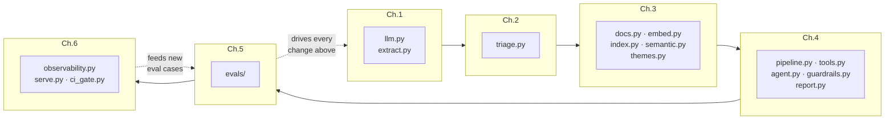

# Chapter 7 — Capstone

*Time: as much as you want. This chapter has no code in it.*

---

## 7.1 What you built

The two dotted arrows are the point. Everything else is plumbing you could have learned
from documentation.

---

## 7.2 Self-assessment

Score yourself honestly. "Could explain in an interview" is not the bar; "did it, and know
what the number was" is.

**LLM foundations**
- [ ] I can estimate the token cost of a corpus without running anything
- [ ] I can say what temperature does and why temperature=0 is not deterministic
- [ ] I got a structured output contract right with enums generated from a source of truth
- [ ] I measured cache hit rates rather than assuming caching worked
- [ ] I chose a model on a measured trade-off, and the trade-off was not cost

**Grounding with data**
- [ ] I built a vector index from scratch and can explain why it's a dot product
- [ ] I know two queries BM25 answers better than embeddings, from my own eval
- [ ] I used a semantic layer instead of text-to-SQL, and can defend that
- [ ] I measured retrieval against long-context stuffing instead of assuming
- [ ] I checked my document cleaner in both directions

**Agentic systems**
- [ ] I wrote an agent loop by hand and can explain every line
- [ ] I can state the rule for workflow vs agent and applied it to a real decision
- [ ] I fixed an agent failure by changing a tool *description*
- [ ] I can name the one defence against injection that actually works
- [ ] I can say when multi-agent is wrong, with the cost multiple

**Evaluation-driven development**
- [ ] I did open coding on 30 outputs by hand before building any eval
- [ ] My failure taxonomy has counts, and I worked the top row
- [ ] I validated an LLM judge against human labels and rejected v1
- [ ] I reported a confidence interval and concluded "not established" at least once
- [ ] I found a problem that was a taxonomy problem, not a prompt problem

**Operating in production**
- [ ] I have a trace store and know what I deliberately don't log
- [ ] I can name an online proxy metric better than "user satisfaction"
- [ ] My CI gates are risk-calibrated, not uniform
- [ ] I made the annual cost table before optimising
- [ ] I ran an incident rehearsal and wrote the postmortem

**ML foundations**
- [ ] I computed a baseline before every model
- [ ] I split temporally and something surprised me
- [ ] I caught a leak that looked like success
- [ ] I calibrated a model and can explain why ranking ≠ probability
- [ ] I chose a threshold from a business constraint, not from F1

Fewer than 20 of 30 means go back rather than forward. The chapters where you skipped the
"Stop and look" boxes are the ones with the empty boxes here.

---

## 7.3 Extensions, roughly in order of what they teach

### A. Voice agent for post-call capture *(hard, high value)*
MSLs dictate notes in the car. Build the capture path: audio → transcript → structured
extraction → confirm-by-voice. The interesting problems are not the ASR. They are: how do
you confirm an extraction without a screen? What happens when the transcript is wrong in a
way that changes the clinical meaning? How do you handle an adverse event mentioned aloud
when the compliance clock starts at "awareness"?
**Teaches:** streaming, turn-taking latency budgets, confirmation UX, error recovery
without a screen.

### B. Generative UI for the insight dashboard *(medium)*
Instead of a fixed dashboard, let the model choose the visualisation for a question — a
trend line for "how has this changed", a KOL table for "who", a theme map for "what".
Constrain it to a component vocabulary with typed props rather than letting it emit code.
**Teaches:** constrained generation, the component-vocabulary pattern, evaluating an
output whose correctness is partly aesthetic.

### C. Computer-use agent for CRM entry *(hard)*
Push accepted insights back into a CRM through its UI. The lesson arrives quickly: this is
brittle, slow, and expensive compared with an API, and the correct engineering answer is
usually "get the API". Worth doing once so you know where the boundary is.
**Teaches:** when *not* to use a capability.

### D. Real-time congress monitoring *(medium)*
During a congress, abstracts drop and MSL notes spike. Build the streaming path:
incremental ingestion, near-real-time theme updates, a daily digest. Watch your drift
alarms fire for a legitimate reason and decide what to do about it.
**Teaches:** incremental indexing, drift under legitimate change, alert fatigue.

### E. Multi-language field notes *(medium)*
EMEA and APAC MSLs write in their own languages. Do you translate then extract, or extract
then translate? Measure both. Check what happens to `verbatim` (it's now in a different
language than the note) and to your token costs (non-English text is 2–3× the tokens).
**Teaches:** cross-lingual retrieval, where translation belongs in a pipeline, schema
assumptions that quietly encoded English.

### F. A second product *(the real test)*
Add a second fictional product with its own taxonomy, fact base and strategic priorities.
How much of your system was accidentally hard-coded to VELTRAXA? This is the extension
that will teach you the most about the code you wrote, and it will be uncomfortable.
**Teaches:** what "configurable" actually costs.

### G. Human-in-the-loop review UI *(medium, highest business value)*
Build the MSL review interface properly: accept, edit, reject with reason, all captured.
Then close the loop — feed corrections into the eval set weekly and measure whether the
system improves. This is the flywheel every serious deployment has and most tutorials skip.
**Teaches:** annotation UX, the label-generation flywheel, measuring improvement over
months rather than commits.

---

## 7.4 The ten things worth carrying to your next project

1. **Look at the data by hand.** Thirty examples, your own eyes, before any metric. There
   is no substitute and there is no shortcut.
2. **Define the task precisely enough that two people agree.** If you can't, no prompt and
   no eval can.
3. **Build the baseline.** A number without a baseline is decoration.
4. **Change one thing, then measure with an interval.** "It looks better" is how projects
   die slowly.
5. **If a check can be code, it must be code.** Design your outputs so the thing you most
   need to verify is mechanically verifiable.
6. **Validate your judge.** An unvalidated judge is a random number generator with good
   manners.
7. **Obligations go in code, not in prompts.** The model may add to a safety gate; it may
   never subtract.
8. **Capability, not cleverness.** The defence that works against injection is the tool
   that doesn't exist.
9. **Instrument on day one.** The seam for tracing is a design decision you make once or
   pay for forever.
10. **Write down what you decided and why — including what you chose not to do.** In six
    months the decision log is worth more than the code.

---

## 7.5 A last word on the loop

Ng's claim is that skilled AI engineers "repeatedly build a piece of software, examine it,
and decide what to try next, taking a sequence of steps that are highly influenced by the
intermediate results."

Notice what that sentence does *not* say. It does not say they know the right architecture
in advance. It does not say they write better prompts. It says they **look**, and then
**decide**, and the deciding is informed by what they saw.

Everything in this tutorial that felt like overhead — the error analysis, the confidence
intervals, the judge validation, the decision log — exists to make that looking honest and
that deciding defensible. The plumbing you could have learned from documentation. The loop
you have to practise.

Go and read your `DECISIONS.md`. If it contains at least one entry that says *"the number
didn't move, and here is what I chose to do about it"*, you have the skill.

---

**Back to:** [README](../README.md) · [Chapter 0](00-orientation.md)
